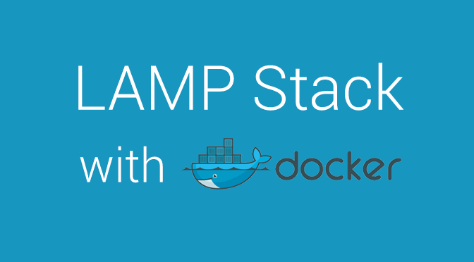

# Awesome Docker Lamp
A Docker image with simple script to build LAMP stack apps (Ubuntu, Apache, PHP and MySql) using single docker image.



## Features (NEW)
- `nano` editor added!
- new version with `node` and `npm` added!


## Tags
- without node: (~845MB) <br>`docker pull khaledalam/awesome-docker-lamp:latest-without-node`
- with node: (~920MB) <br>`docker pull khaledalam/awesome-docker-lamp:latest-with-node`


## Run
- `git clone git@github.com:khaledalam/awesome-docker-lamp.git`
- `cd awesome-docker-lamp`
- `bash run.sh`

go to url: http://your_host_ip:8000 <br>
ex. http://127.0.0.1:8000 <br>
ex. http://localhost:8000 <br>

## FAQ
- > got error `.. bind: address already in use..`
    ```
    Make sure to use ports which are open and not in use on your host machine.
    
    PORT_HOST=8001
    PORT_HOST_SQL=3306

    ex. `8001` and `3306` 
    ```


## Inspiration
This image was originally based on [mattrayner/docker-lamp](https://github.com/mattrayner/docker-lamp), with a few changes to make building much eaiser.
